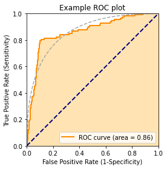
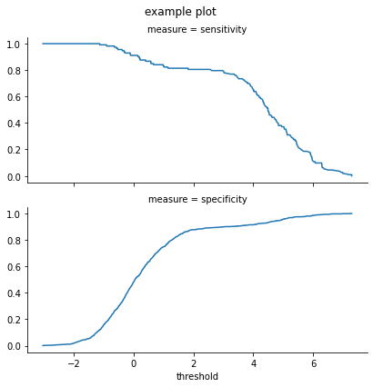
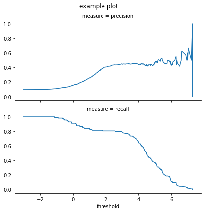
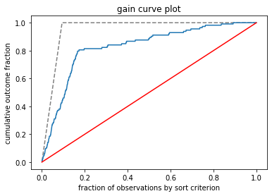
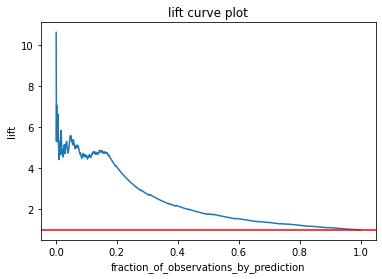

[wvu](https://github.com/WinVector/wvu) is a simple 
set of utilities for doing and teaching data science and machine learning methods.
They are not replacements for the standard methods in sklearn.


```python
import numpy.random
import pandas
import wvu.util

wvu.__version__
```


    '0.3.6'


Illustration of cross-method plan.


```python
wvu.util.mk_cross_plan(10, 2)
```


    [{'train': [2, 3, 7, 8, 9], 'test': [0, 1, 4, 5, 6]},
     {'train': [0, 1, 4, 5, 6], 'test': [2, 3, 7, 8, 9]}]


Plotting example


```python
help(wvu.util.plot_roc)
```

    Help on function plot_roc in module wvu.util:
    
    plot_roc(prediction, istrue, title='Receiver operating characteristic plot', *, truth_target=True, ideal_line_color=None, extra_points=None, show=True)
        Plot a ROC curve of numeric prediction against boolean istrue.
        
        :param prediction: column of numeric predictions
        :param istrue: column of items to predict
        :param title: plot title
        :param truth_target: value to consider target or true.
        :param ideal_line_color: if not None, color of ideal line
        :param extra_points: data frame of additional point to annotate graph, columns fpr, tpr, label
        :param show: logical, if True call matplotlib.pyplot.show()
        :return: calculated area under the curve, plot produced by call.
        
        Example:
        
        import pandas
        import wvpy.util
        
        d = pandas.DataFrame({
            'x': [1, 2, 3, 4, 5],
            'y': [False, False, True, True, False]
        })
        
        wvpy.util.plot_roc(
            prediction=d['x'],
            istrue=d['y'],
            ideal_line_color='lightgrey'
        )
        
        wvpy.util.plot_roc(
            prediction=d['x'],
            istrue=d['y'],
            ideal_line_color='lightgrey',
            extra_points=pandas.DataFrame({
                'tpr': [0, 1],
                'fpr': [0, 1],
                'label': ['AAA', 'BBB']
            })
        )
    


```python
d = pandas.concat([
    pandas.DataFrame({
        'x': numpy.random.normal(size=1000),
        'y': numpy.random.choice([True, False], 
                                 p=(0.02, 0.98), 
                                 size=1000, 
                                 replace=True)}),
    pandas.DataFrame({
        'x': numpy.random.normal(size=200) + 5,
        'y': numpy.random.choice([True, False], 
                                 size=200, 
                                 replace=True)}),
])
```


```python
wvu.util.plot_roc(
    prediction=d.x,
    istrue=d.y,
    ideal_line_color="DarkGrey",
    title='Example ROC plot')
```


    <Figure size 432x288 with 0 Axes>


    

    


    0.861085556577737


```python
help(wvu.util.threshold_plot)
```

    Help on function threshold_plot in module wvu.util:
    
    threshold_plot(d: pandas.core.frame.DataFrame, pred_var: str, truth_var: str, truth_target: bool = True, threshold_range: Iterable[float] = (-inf, inf), plotvars: Iterable[str] = ('precision', 'recall'), title: str = 'Measures as a function of threshold', *, show: bool = True) -> None
        Produce multiple facet plot relating the performance of using a threshold greater than or equal to
        different values at predicting a truth target.
        
        :param d: pandas.DataFrame to plot
        :param pred_var: name of column of numeric predictions
        :param truth_var: name of column with reference truth
        :param truth_target: value considered true
        :param threshold_range: x-axis range to plot
        :param plotvars: list of metrics to plot, must come from ['threshold', 'count', 'fraction',
            'true_positive_rate', 'false_positive_rate', 'true_negative_rate', 'false_negative_rate',
            'precision', 'recall', 'sensitivity', 'specificity', 'accuracy']
        :param title: title for plot
        :param show: logical, if True call matplotlib.pyplot.show()
        :return: None, plot produced as a side effect
        
        Example:
        
        import pandas
        import wvpy.util
        
        d = pandas.DataFrame({
            'x': [1, 2, 3, 4, 5],
            'y': [False, False, True, True, False]
        })
        
        wvpy.util.threshold_plot(
            d,
            pred_var='x',
            truth_var='y',
            plotvars=("sensitivity", "specificity"),
        )
    


```python
wvu.util.threshold_plot(
        d,
        pred_var='x',
        truth_var='y',
        plotvars=("sensitivity", "specificity"),
        title = "example plot"
    )
```


    

    


```python

wvu.util.threshold_plot(
        d,
        pred_var='x',
        truth_var='y',
        plotvars=("precision", "recall"),
        title = "example plot"
    )
```


    

    


```python
help(wvu.util.gain_curve_plot)
```

    Help on function gain_curve_plot in module wvu.util:
    
    gain_curve_plot(prediction, outcome, title='Gain curve plot', *, show=True)
        plot cumulative outcome as a function of prediction order (descending)
        
        :param prediction: vector of numeric predictions
        :param outcome: vector of actual values
        :param title: plot title
        :param show: logical, if True call matplotlib.pyplot.show()
        :return: None
        
        Example:
        
        d = pandas.DataFrame({
            'x': [.1, .2, .3, .4, .5],
            'y': [0, 0, 1, 1, 0]
        })
        
        wvpy.util.gain_curve_plot(
            prediction=d['x'],
            outcome=d['y'],
        )
    


```python
wvu.util.gain_curve_plot(
        prediction=d['x'],
        outcome=d['y'],
        title = "gain curve plot"
)
```


    

    


```python
wvu.util.lift_curve_plot(
        prediction=d['x'],
        outcome=d['y'],
        title = "lift curve plot"
)
```


    

    


```python

```
